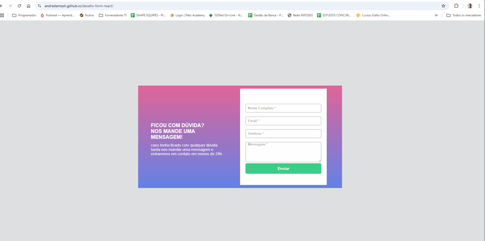

# 📝 Formulário React com React Hook Form

Projeto de um formulário de contato utilizando **React** com a biblioteca **React Hook Form** para gerenciamento de estado e validações de forma simples e eficiente.

---

## 📌 Funcionalidades

- ✅ Validação de campos obrigatórios
- ✅ Feedback visual (borda vermelha para erros, verde para acertos)
- ✅ Verificação de formato de e-mail e telefone
- ✅ Mensagem de erro customizada abaixo de cada campo
- ✅ Estilização com CSS modular

---

## 🚀 Tecnologias

- [React](https://reactjs.org/)
- [React Hook Form](https://react-hook-form.com/)
- HTML5 + CSS3

---

## 📷 Demonstração

 <!-- Coloque um gif ou imagem do projeto funcionando aqui -->

---
